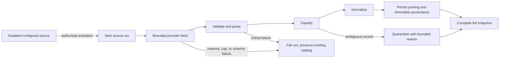

# Official JD Adapter Research and Contract Decisions

**Project:** GradPath
**Date:** 2026-07-13
**Scope:** Greenhouse, Lever, Ashby, and SmartRecruiters public job-posting feeds
**Status:** Research decision record; no adapter implementation is authorized by this document

## Executive summary

GradPath should not attempt to “scour the entire internet” through general web scraping. The safe and maintainable interpretation is a permission-first catalog of explicitly configured employer accounts on official public posting APIs. Each source must have an accountable owner, a recorded permission basis, a fixed provider account, and an exact provider-owned API host. The system must never discover board tokens, crawl search engines, bypass authentication, or accept arbitrary fetch URLs.

The four providers support a useful first catalog, but their contracts differ enough that they need independent parsers behind one strict intermediate model:

| Provider | Retrieval model | Stable identity | Reliable time fields | Important constraint |
|---|---|---|---|---|
| Greenhouse | One board snapshot; optional per-job detail | Posting `id` | `first_published`, `updated_at`, optional `application_deadline` | Description is HTML/entity encoded; do not ingest application questions |
| Lever | `skip`/`limit` pages with no total count | Posting `id` | No publication/update time documented for public postings | Global and EU hosts differ; end pagination only on a short page |
| Ashby | One complete board snapshot | Canonical `jobUrl`; live payloads also expose an ID | `publishedAt` | `isListed=false` means direct-link-only and should not enter browseable results by default |
| SmartRecruiters | Offset/limit list plus one detail request per posting | Posting `id` | `releasedDate`; no documented deadline | List payload is incomplete; full JD sections require the detail endpoint |

The current registry’s identity and change-detection strategies are largely correct. Before network code, it needs a distinct fetch-host policy, because provider API hosts are not the same as student-facing links, and some providers document employer-controlled URLs. Public ATS listings must be classified as `off_campus`; campus SI, placement, and PS-II eligibility can only come from a campus-authorized source. An ambiguous employment type must be quarantined for review, not silently inferred from a title.

Recommended delivery order:

1. Pure provider schemas, synthetic fixtures, parsers, and classification outcomes.
2. A bounded HTTP client tested through a fake transport.
3. Source-run orchestration, immutable provenance, and catalog persistence.
4. Scheduler and catalog read/search APIs.

No provider should be enabled until its account configuration, permission evidence, machine identity, failure behavior, and full-snapshot semantics have been tested.

## Research method and evidence boundary

The findings combine official provider documentation with bounded read-only probes of provider-owned public endpoints on 2026-07-13. Documentation is treated as the contract. Probe results such as observed ETags, response size, and currently present undocumented fields are observations only; they must not become required schema fields without official support.

Primary references:

- Greenhouse: [Job Board API](https://developers.greenhouse.io/job-board.html)
- Lever: [Lever Postings API](https://github.com/lever/postings-api)
- Ashby: [Public Job Posting API](https://developers.ashbyhq.com/docs/public-job-posting-api)
- SmartRecruiters: [Posting API endpoints](https://developers.smartrecruiters.com/docs/endpoints), [Customer API overview](https://developers.smartrecruiters.com/docs/customer-overview), and [deprecation and sunset policy](https://developers.smartrecruiters.com/docs/deprecation-and-sunset-policies)

## Non-negotiable source policy

Every source is an explicitly configured `ProviderAccountConfig` with:

- provider and source-account identifier;
- employer display name;
- Lever region where applicable;
- recorded permission basis and accountable owner;
- exact canonical API host selected by server-side provider policy;
- adapter/schema version;
- enabled state, defaulting to disabled.

The connector constructs its endpoint from the provider and a validated account slug. It accepts no arbitrary URL, follows no redirect, uses TLS only, sends no browser cookies, and resolves only the provider’s fixed API hosts:

| Provider | Exact allowed fetch API hosts | Documented or observed student-link shapes |
|---|---|---|
| Greenhouse | `boards-api.greenhouse.io` | Greenhouse hosts or the employer-controlled `absolute_url` documented by Greenhouse |
| Lever | `api.lever.co`, `api.eu.lever.co` | `jobs.lever.co`, `jobs.eu.lever.co` |
| Ashby | `api.ashbyhq.com` | `jobs.ashbyhq.com` |
| SmartRecruiters | `api.smartrecruiters.com` | Documented `applyUrl` may use `www.smartrecruiters.com`; `jobs.smartrecruiters.com` listing pages were observed but are not guaranteed by the endpoint schema |

The fetch column is an exhaustive server-side allowlist. The student-link column is not a fetch allowlist and must not be treated as one. Provider-declared listing/application links are outbound browser destinations only: require HTTPS, forbid credentials and non-default ports, normalize internationalized hosts, and show the destination host before navigation. GradPath never requests these links server-side. A provider API reference remains internal provenance; it is not presented as a canonical public listing.

## Common adapter boundary

Provider responses should first become a strict `ProviderPosting` candidate, before they enter the existing normalization service:

| Field | Rule |
|---|---|
| `provider` / `source_account` | Required and copied from trusted account configuration |
| `external_id` | Provider posting ID when documented; optional only where canonical URL is the selected identity |
| `provider_record_ref` | Server-only documented API reference or constructed provider record identity; never a browser navigation target |
| `public_listing_url` | Optional provider-declared job-page URL that passes the outbound-link policy; it need not be provider-hosted |
| `application_url` | Optional provider-declared apply URL that passes the outbound-link policy; GradPath links out rather than submitting applications |
| `title`, `description`, `location` | Bounded, normalized text; title and description required |
| `published_at`, `updated_at`, `application_deadline` | Optional and populated only from documented semantics |
| `employment_signal` | Provider-native employment field plus its source field name |
| `classification_status` | `accepted`, `needs_review`, or `rejected`, with a bounded reason code |
| `snapshot_hash` | Hash of the deterministic provider record representation |
| `adapter_version`, `observed_at` | Required provenance facts |

This intermediate layer is necessary because the existing normalizer requires a track and opportunity kind, while public feeds can contain full-time roles, internships, ambiguous roles, and unlisted postings. Classification failure must happen before verified-catalog persistence.

## Provider contracts

### Greenhouse

The official public list endpoint is:

```text
GET https://boards-api.greenhouse.io/v1/boards/{board_token}/jobs?content=true
```

Greenhouse documents public GET access without authentication. The list response is a complete board snapshot with `jobs` and `meta.total`. Posting `id` is the correct stable identity for this catalog. `internal_job_id` identifies the underlying job rather than the posting and may be null for prospect posts, so it is not a safe replacement. The documented job data includes `title`, `updated_at`, `location.name`, `absolute_url`, and optional embedded `content`; the detail form adds `company_name`, `first_published`, and optional `application_deadline`. [Greenhouse Job Board API](https://developers.greenhouse.io/job-board.html)

Adapter decisions:

- Request `content=true` for the normal snapshot path; use per-job detail only when a documented required field is absent from the list response.
- Store `id` as external identity. Treat `absolute_url` as a provider-declared outbound listing URL, not as a server fetch target: accept only HTTPS links that pass the outbound-link policy, otherwise quarantine the link while retaining the posting and its internal provider provenance.
- Decode HTML entities, sanitize provider HTML without loading scripts or remote resources, and convert it to deterministic bounded text.
- Use `first_published`, `updated_at`, and `application_deadline` only when present and valid.
- Resolve the employer name from documented board/detail metadata rather than prettifying the board token.
- Ignore questions, compliance, demographic, and application-form fields; JD ingestion does not require applicant data.
- Treat the snapshot as complete only when it parses successfully and the accepted/quarantined counts reconcile with `meta.total`.

The existing `UPDATED_AT_AND_CONTENT_HASH` strategy is appropriate. A current provider-owned board emitted ETag headers during the probe, but conditional `304` behavior must be proven by tests before it is relied upon. No documented Job Board GET rate limit was found; the client should therefore use conservative request pacing and bounded handling of `429`, not assume unlimited access.

### Lever

Lever’s public postings API is designed for published job sites. Its documented list shape is:

```text
GET https://api.lever.co/v0/postings/{site}?skip={offset}&limit={page_size}
Accept: application/json
```

EU accounts use the corresponding `api.eu.lever.co` and `jobs.eu.lever.co` hosts. List responses are arrays and do not include a total count, so the adapter advances `skip` by the received record count and ends only when a page is shorter than the requested limit. Posting `id` is stable; `text` is the title; `categories` carries location, team, department, commitment, and related values. The official contract provides plain-text description fields as well as labelled list sections, `hostedUrl`, `applyUrl`, and workplace type. [Lever Postings API](https://github.com/lever/postings-api)

Adapter decisions:

- Select global or EU hosts from trusted account configuration; never infer the region by following a redirect.
- Build description text deterministically from the documented plain fields and labelled list content, removing duplicated material.
- Use `categories.commitment` as an employment signal when present.
- Use `hostedUrl` for provenance and `applyUrl` only as an outbound redirect target.
- Take the employer display name from source onboarding configuration because the posting response does not reliably supply it.
- Maintain a seen-ID set; duplicate IDs, repeated pages, a page-limit breach, or a record-limit breach fail the run.

The public contract does not document a publication or update timestamp. A live response contained `createdAt`, but GradPath must not map that undocumented observation to `published_at`. The existing `SNAPSHOT_AND_CONTENT_HASH` strategy is therefore correct. Lever documents an application-submission limit, not a public GET limit; this catalog still needs modest pacing, bounded retries, and `429` handling.

### Ashby

Ashby exposes the currently published jobs for a configured board through:

```text
GET https://api.ashbyhq.com/posting-api/job-board/{job_board_name}?includeCompensation=false
```

The response is one unpaginated snapshot with `apiVersion` and `jobs`. Documented posting fields include title, primary and secondary locations, department, team, `isListed`, remote/workplace flags, plain and HTML descriptions, `publishedAt`, employment type, `jobUrl`, and `applyUrl`. [Ashby Public Job Posting API](https://developers.ashbyhq.com/docs/public-job-posting-api)

Adapter decisions:

- Require `apiVersion == "1"`; any unsupported version fails the run before persistence.
- Use the canonical `jobUrl` as identity input and provenance URL. Current responses also expose UUID IDs, but the adapter must tolerate their absence because the documented field table has not consistently required them.
- Use `descriptionPlain`, `publishedAt`, and `employmentType` directly after bounds/type validation.
- Exclude `isListed=false` records from the browseable catalog by default because they are direct-link-only listings.
- Use the configured employer display name; the board response does not reliably carry it.
- Keep compensation excluded for the first adapter contract to minimize schema and policy surface.

The existing canonical-URL identity and `PUBLISHED_AT_AND_CONTENT_HASH` strategy are appropriate. A live board response was approximately 1.86 MiB, so a one-megabyte response cap would reject valid boards. The fetcher should stream with separate compressed and decompressed limits, initially 16 MiB, and fail cleanly rather than truncate. ETag and a short public cache lifetime were observed, but are not treated as contractual guarantees.

### SmartRecruiters

SmartRecruiters’ Posting API is public and intended for career sites and integrations. The list endpoint is offset paginated:

```text
GET https://api.smartrecruiters.com/v1/companies/{company_identifier}/postings?limit={page_size}&offset={offset}
```

It returns `totalFound` and partial records. The adapter must then request each posting’s detail endpoint to obtain the full job ad. List data includes posting `id`, name, company, `releasedDate`, location, employment type, and an API reference. Detail data adds `applyUrl`, active state, and the structured job-ad sections for company description, job description, qualifications, and additional information. [SmartRecruiters Posting API endpoints](https://developers.smartrecruiters.com/docs/endpoints)

Adapter decisions:

- Use posting `id` as stable identity.
- Page until the processed offset reconciles with `totalFound`, subject to strict page and record caps.
- Fetch details only from the server-constructed API-host path for each validated ID; do not follow a response-provided arbitrary URL.
- Join the documented job-ad sections in a fixed titled order to produce deterministic description text.
- Use `releasedDate` as publication time and `typeOfEmployment` as the employment signal.
- Retain the documented API `ref` as server-only provenance after independently validating its exact API host and posting ID. Do not call it a public listing URL.
- Treat `applyUrl` as the documented outbound student action. It may use `www.smartrecruiters.com`; validate it with the outbound-link policy rather than assuming a `jobs.smartrecruiters.com` host.
- Populate an optional `public_listing_url` only when the response supplies one with documented semantics. A currently observed `jobs.smartrecruiters.com` URL pattern is not enough to construct or require one.
- Drop all response cookies. A public probe emitted `Set-Cookie`, but the connector has no cookie jar and must not persist or forward those values.

The Posting API does not document an application deadline. The provider describes posting data as the last published snapshot, so content changes require content-hash comparison. The existing offset pagination and `SNAPSHOT_AND_CONTENT_HASH` strategy are appropriate. SmartRecruiters documents 10 requests per second and eight concurrent requests for its authenticated Customer API, but that does not establish a public Posting API limit. GradPath should apply its own conservative policy—initially two to four concurrent detail requests with low bounded throughput—and honor `429`/`Retry-After` without claiming the Customer API numbers as Posting API guarantees. [SmartRecruiters Customer API overview](https://developers.smartrecruiters.com/docs/customer-overview)

SmartRecruiters also publishes a deprecation policy with advance notice and backward-compatibility expectations, but GradPath must still pin adapter versions and alert on schema failures. [SmartRecruiters deprecation and sunset policy](https://developers.smartrecruiters.com/docs/deprecation-and-sunset-policies)

## Track and opportunity classification

An internet ATS record is evidence of a public opportunity, not evidence of BITS eligibility or campus participation.

- Public provider records can enter only the `off_campus` track.
- SI and placement records require a campus-authorized source that explicitly establishes the campus track and eligibility context.
- PS-II station records require a campus-authorized PS-II source. A public employer internship must never be relabelled as a PS-II station.
- Lever commitment, Ashby employment type, and SmartRecruiters employment type may provide explicit internship/full-time signals.
- Greenhouse exposes no universally guaranteed standard employment-type field; custom metadata cannot be assumed consistent across employers.
- Title heuristics may produce a review hint, but they may not create a verified classification.
- Missing, contradictory, or unsupported employment signals produce `needs_review`; they do not silently default to internship.

This distinction prevents GradPath from making false claims that could affect a student’s academic or placement decisions.

## Sync correctness and failure semantics



Required run behavior:

- Create the source-run record before the first network request.
- Apply connect, read, overall-run, page, record, compressed-byte, decompressed-byte, and field-size limits.
- Retry only bounded transient failures such as `429`, `502`, `503`, and `504`, with jitter and `Retry-After` support.
- Disable redirects and cookies; validate TLS, scheme, port, resolved address policy, and exact host on every request.
- Persist an observed ETag in source-run cursor state, but treat conditional retrieval as an optimization that requires provider-specific tests.
- Tolerate unknown additive fields while strictly validating critical identity, URL, title, content, and pagination fields.
- Quarantine an invalid individual record only when snapshot integrity remains provable. Pagination, version, duplicate-identity, reconciliation, or response-bound failures fail the whole run.
- Record immutable provenance for every accepted or quarantined observation using bounded metadata, content fingerprints, adapter version, and observation time.
- Log counts and bounded error codes only. Do not log descriptions, source credentials, complete URLs, response cookies, or applicant data.

Deactivation or tombstoning is intentionally deferred. It is safe only after a successful complete snapshot and requires explicit `active`, `last_seen_at`, and deactivation semantics that the current JD table does not yet provide. A partial, capped, cancelled, or failed run must never remove catalog records.

## Content, provenance, and fixture policy

Canonical content may deduplicate identical postings across providers, but every provider observation keeps its own immutable provenance receipt. This allows the catalog to update efficiently without erasing where and when a JD was observed.

Repository fixtures should be small, synthetic, schema-shaped examples based on documented field structures. They must be labelled as test fixtures and must not contain volatile live JDs or full copyrighted descriptions. Real postings are fetched at runtime only from authorized configured sources and are stored under the project’s retention and provenance rules.

For pathway guidance, a JD corpus should retain evidence metadata and content fingerprints. Guidance must cite the postings and snapshot times that support a skill or project recommendation; it must not present model inference as a provider fact.

## Contract test plan

### Pure parser tests

- Minimal and representative valid payload per provider.
- Unknown additive fields are ignored safely.
- Missing/invalid critical fields produce bounded quarantine or run-failure codes as specified.
- Duplicate JSON keys, non-finite numbers, wrong types, excessive nesting, oversized strings, and invalid Unicode fail safely.
- Description assembly is deterministic and contains no markup, scripts, remote resources, or duplicated sections.
- Fetch references must use exact provider API hosts; optional listing/apply links must pass the separate outbound-link policy and are never server-fetched.
- Provider identity and content hashes are stable across key-order changes.
- Employment signals produce accepted, review, and rejected outcomes without campus-track inference.

### Pagination and snapshot tests

- Greenhouse total reconciliation and empty board.
- Lever multiple pages, exact-full final page followed by empty page, repeated page, duplicate ID, and record/page caps.
- Ashby supported/unsupported API version, large streamed response, and unlisted record policy.
- SmartRecruiters offset progression, changing/malformed totals, detail failure, bounded concurrency, and list/detail identity mismatch.

### HTTP boundary tests

- Exact global/EU host construction and no arbitrary URL acceptance.
- Redirect rejection, public-to-private DNS rebinding defense, TLS-only behavior, and default-port enforcement.
- Compressed/decompressed byte limits, timeouts, cancellation, and slow-stream behavior.
- `429` with valid/invalid `Retry-After`, retryable 5xx, non-retryable 4xx, and retry-budget exhaustion.
- No cookie persistence or forwarding.
- ETag capture and provider-specific conditional-request behavior through a fake transport.
- Logs and errors contain no descriptions, credentials, cookies, or complete URLs.

### Persistence tests

- Run starts before fetch and finishes atomically with counts/status.
- Posting upsert and provenance receipt are idempotent across repeated snapshots.
- Changed content produces a new fingerprint/receipt without losing history.
- Failed and partial runs preserve the existing catalog.
- Cross-provider deduplication preserves both provenance chains.
- Source account and tenant/campus isolation cannot be crossed by crafted provider data.

## Implementation decision and phases

### Phase A — pure contracts

Add provider response schemas, synthetic fixtures, pure parsers, `ProviderPosting`, and classification outcomes. No network, database, scheduler, or route activation. This is the smallest safe next implementation slice.

### Phase B — bounded transport

Add the provider-host policy and a shared async HTTP fetcher with fake-transport contract tests, streaming limits, retries, ETag capture, and zero cookie/redirect behavior. Provider adapters remain callable only from tests or internal services.

### Phase C — source-run orchestration

Connect adapters to the existing source registry, source-run repository, normalization service, and immutable provenance persistence. Add explicit source-registration and authorization evidence. All provider sources remain disabled until individually approved.

### Phase D — scheduled catalog

Add scheduler controls, operational metrics, failure alerts, manual re-run controls, and catalog read/search APIs. Activation is gradual per provider account. Tombstone behavior is a separate migration and design decision.

Campus-authorized SI, placement, and PS-II connectors are separate source families. They may reuse transport and provenance infrastructure, but they must not inherit public-ATS classification rules or imply official BITS endorsement.

## Confidence assessment

| Area | Confidence | Basis / remaining uncertainty |
|---|---|---|
| Greenhouse retrieval and field mapping | High | Official Job Board API plus current public probe; conditional GET and undocumented rate behavior still require tests |
| Lever retrieval and field mapping | High | Official Postings API repository plus current public probe; no documented publication/update time or GET rate limit |
| Ashby retrieval and field mapping | High | Official public posting documentation plus current large-board probe; current ID presence is treated as optional |
| SmartRecruiters list/detail mapping | High | Official endpoint and platform documentation plus current public probe |
| Cross-provider transport controls | High | Provider endpoints are known; exact operational limits are conservative project policy |
| Automatic internship/full-time classification | Medium | Three providers expose useful signals; Greenhouse and employer-specific values require review handling |
| Campus SI/placement/PS-II classification from public ATS | High confidence that it is unsafe | Public feeds do not establish campus authorization or academic eligibility |
| Deactivation/tombstone semantics | Low until designed | Current persistence model lacks the required active/last-seen state |

## Final recommendation

Proceed with Phase A only: pure schemas, synthetic fixtures, parsers, and explicit classification outcomes. Keep all network and provider sources disabled. The implementation should preserve the current registry strategies, add a separate `FETCH_API_HOSTS` policy, treat public ATS records as off-campus only, and reject or quarantine ambiguity before the existing normalizer. This creates a testable foundation without exposing GradPath to uncontrolled crawling, false campus claims, schema drift, or destructive partial-sync behavior.
